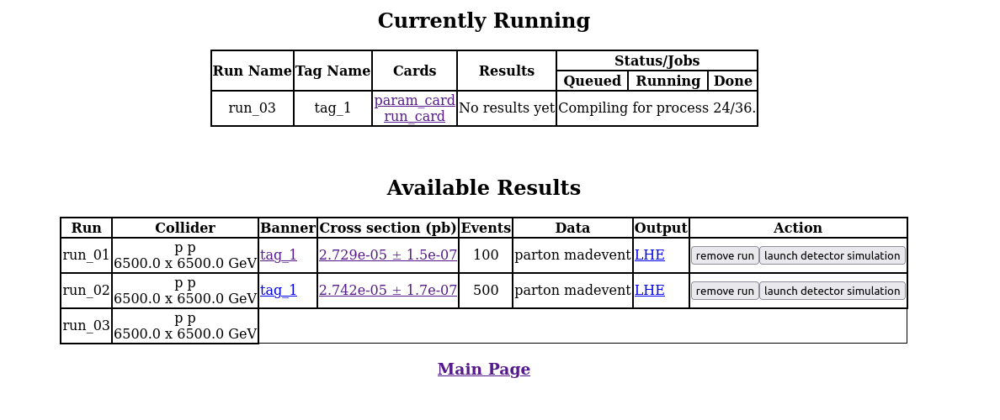
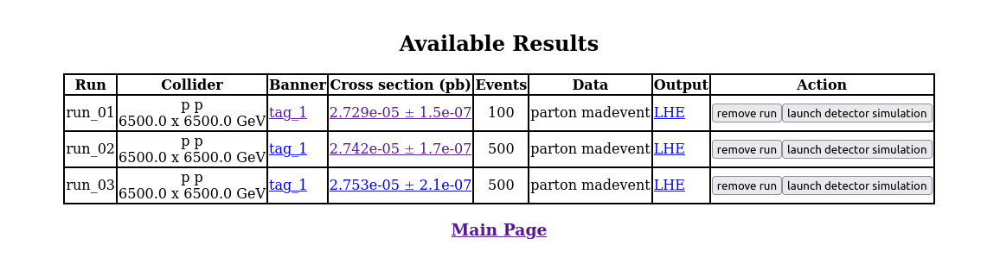

# EventGeneration
We will learn two aspects of event generation,
- *MC instructions* on how to produce events using MadGraph, Pythia, Delphes etc in general and using unique Model UFO files.
-  Producing gridpacks to NanoAOD samples which includes CMS detector simulation will be added later. <br>

This is a work involving many people over a past few years in CMS multilepton group. I'm documenting them with my own analysis requirement and with some basic usage tips of these event generation softwares based on my experience.

**Contact Person:** Arnab Laha (arnab.laha@cern.ch)

## Resources
- How to produce gridpack: https://twiki.cern.ch/twiki/bin/viewauth/CMS/QuickGuideMadGraph5aMCatNLO
- Basic MadGraph usage   : https://twiki.cern.ch/twiki/bin/view/CMSPublic/MadgraphTutorial

## About the VLL UFO file
Ask me for the VLL model UFO file ```VLL.zip ``` (this is private). In addition, some relevant information provided by the authors about this model file are -
```- PARTICLES: tau’ -> lp (lp~ being its antiparticle), nu’ -> vlp (vlp~ being its antiparticle) 
- MASSES: The masses of these particles (“MLP" (mass of tau’) and “ MVLP” (mass of nu’)) are by default set to 100 GeV, 
  which can be changed during the runtime in “Block mass” of the “param_card.dat”.
  
- WIDTHS: Also Widths ("WLP" and "WVLP" for widths of tau’ and nu’ respectively) are by default set to 1 GeV, 
  which could also be changed during the runtime.
  
- SWITCHING BETWEEN SINGLET & DOUBLET MODELS: By default, the UFO file is set to “singlet model”. This can also
  be changed to “doublet model” (during runtime) by changing the "Weak Isospin" of tau’ (called “Tl”) in “Block Isospin” 
  of “param_card.dat” from “0.0” (singlet) to “-0.5”(doublet).
  ```
<br>

## Generating MadEvent or LHE files only with MadGraph
Follow these instructions to generate LHE files using MadGraph only. This procedure doesn't need CMSSW environment. For our master student's thesis.
- MadGraph Version: 3.4.1
- python: 3.7 or more (strict requirement)

**Notation:** ```>>>```: code , ```%```: comment

**step 1:** Untar the VLL.zip UFO model file and keep it in ```models/``` directory of your MadGraph setup.
```
>>> cd MG5_aMC_v3_4_1
>>> ls   %you should see models directory
>>> cp <path to untar model UFO files> <models/>
```
### VLL Singlet Model
Let's do this step by step for the first time. By default the model is singlet and mass is set to 100 GeV. These steps will produce a new directory ```VLLSinglet``` with lots of subdirectory. You are always encouraged to look them in details as much as possible.

```
>>> ./bin/mg5_aMC
MG5_aMC>>> import model VLL
MG5_aMC>>> define vll = lp lp~
MG5_aMC>>> define boson = w+ w- z h a 
MG5_aMC>>>define tau = ta+ ta- vt vt~
MG5_aMC>>>generate p p > vll vll, vll > boson tau
MG5_aMC>>>output VLLSinglet

%This may take some time. This will generate different feynmann diagrams for the process. You can now generate events following the onscreen instructions. But let's not do that. Instead avoid this CLI and follow next steps.

MG5_aMC>>> exit
>>> cd VLLSinglet
>>> ls 

```
That's a great progress! Now we will see how the parameter can be changed for the event generation. You can see	```Cards/``` in this directory.

```
>>> cd Cards
>>> ls
```
The important cards relevant to us are:
- param_card.dat
- proc_card_mg5.dat
- run_card.dat

**Please take a detailed look on these cards**

- **param_card.dat** contains the all the model specific parameters that you can play with. Two Blocks are essential:
- **BLOCK ISOSPIN**: for singlet the values is zero. For example,
```
 ###################################
 BLOCK ISOSPIN #
       1 0.000000e+00 # tl
 ###################################

```
- **BLOCK MASS**: Check if particles mass are as expected or not. Then look for ```mlp``` and ```mvlp```. Particle ID for these new particles are 17 and 18 respectively and mass is set to 100 as default value. For example,
```
 ###################################
 ## INFORMATION FOR MASS
 ###################################
 BLOCK MASS #
       1 5.040000e-03 # md
       2 2.550000e-03 # mu
       3 1.010000e-01 # ms
       4 1.270000e+00 # mc
       5 4.700000e+00 # mb
       6 1.720000e+02 # mt
       11 5.110000e-04 # me
       13 1.056600e-01 # mmu
       15 1.777000e+00 # mta
       17 1.000000e+02 # mlp
       18 1.000000e+02 # mvlp
       23 9.118760e+01 # mz
       25 1.250000e+02 # mh
       12 0.000000e+00 # ve : 0.0
       14 0.000000e+00 # vm : 0.0
       16 0.000000e+00 # vt : 0.0
       21 0.000000e+00 # g : 0.0
       22 0.000000e+00 # a : 0.0
       24 7.982436e+01 # w+ : cmath.sqrt(mz__exp__2/2. + cmath.sqrt(mz__exp__4/4. - (aew*cmath.pi*mz__exp__2)/(gf*sqrt__2)))

```
- **proc_card_mg5.dat** has just the process decay chains as you given in madgraph prompt. It's good to check if everything is in order or not.

- **run_card.dat:** Here you can change no of events you want to generate, place some cuts on objects, beam energy, PDF(Parton distribution functions) and phase space matching as well.  
<br>
Okay! Now again let's get back to action. Generate 500 events of Mass 100 GeV VLL Singlet Model.

```
%EventGenerationCodeBlock
>>>cd ..
>>> ./bin/generate_events

% follow onscreen instruction. 0: to proceed --> 0: no change needed in card
% then it should start generating events  
```
During this a new tab in your default browser should open and looks like this,



and when it is completed it shows,

```
INFO: Combining runs 
sum of cpu time of last step: 29 seconds
INFO: finish refine 
refine 500 --treshold=0.9
No need for second refine due to stability of cross-section
INFO: Combining Events 
  === Results Summary for run: run_03 tag: tag_1 ===

     Cross-section :   2.753e-05 +- 2.07e-07 pb
     Nb of events :  500
 
```
and the webbrowser tab looks like,


Now you can use the ```lhe.gz``` file and proceed with Pythia -->Delphes and so on. 

```
>>> cd Events
>>> ls
% you should see different run folders
>>> unzip run_03/unweighted_events.lhe.gz
```

**To produce events for different mass points please change mass of ```lp``` in BLOCK MASS in the param card and redo EventGenration code block**.

NB: Be careful, check if higgs mode are turned on or not when VLL Mass is more than Higgs mass(125 GeV).

NB2: Better if you look at the untar VLL/ folder and check how different parameters are implemented there.

Don't assume whatever is written is correct or changing param card will automatically change stuffs. Produce, check and verify every details. 

